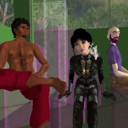
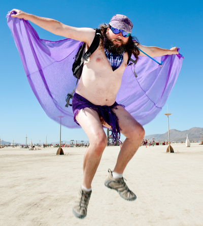

This blog started out as a way to share the stuff I created in [Second Life](http://en.wikipedia.org/wiki/Arts_in_Second_Life). Second Life is an online virtual social environment where what you can make and be is limited only by your imagination. One of the things that took place in Second Life was a virtual Burning Man like event called [Burning Life](http://wiki.secondlife.com/wiki/Burning_Life). Through [Eye Ree](http://world.secondlife.com/resident/c2c409f7-f580-4928-8485-922fdc205a90), my Second Life avatar, I created some of the art shown in this blog for Burning Life events.

But Eye Ree was not my only Second Life avatar. There was also Tina Yugen and Anima Ahn. Role playing them taught me some interesting things about myself. With them I explored my gender and sexual identity, social roles, fashion, interior design and other things. I spent most of my time in Second Life as Tina.

My virtual experiences in Second Life increased my awareness of some long ignored aspects of myself and reawakened the artist in me. Eye Ree, Tina and Anima were the Second Life group "Completely Different". Three different aspects to my personality represented virtually.

The experiences also rekindled my interested in Burning Man. For years I had been interested in going mostly for the alternative lifestyle aspects of it. But Burning Life changed how I saw Burning Man, just as Second Life in general changed how I saw myself.

I went to Burning Man for the first time in 2010. I missed 2011 but, if things work out, I will return in 2012.

I've decided to adopt Eye Ree as my playa name and use this blog to talk about my Burning Man experiences.

_**"What do you want out of Burning Man?"**_

A friend recently asked me that question. What's the appeal? Why do I go? I don't have a simple answer.

What I really want to do is create the same sorts of big, lighted, interactive art I made for Burning Life  for Burning Man. But that isn't really the answer to the question. The question would be why?

A big part of the appeal of Burning Man for me is the special challenge of the event. Burning Man is, first and foremost, a social event and I don't do social well. I'm not wired like most people. To get the most out of Burning Man, I have to step out of my comfort zone and engage with people.

There is also the challenge of the physical. The my skills and experience are with the digital. I know how to get things done with a computer, but designing, building, and installing a large work of art on the playa is currently beyond my ability. And the social thing makes it hard for me to find people willing to help.

And finally there is also the simple thrill of participating in an event as unique to the human experience as Burning Man. The transcendence of the mundane. The catharsis of reality. Or something like that.

_**"I want to want something."**_

This was the wish I wrote on some art left out on the playa in 2010 for that purpose.

I got my wish. I want to be a part of Burning Man year after year.

But I'm still not sure I know how to answer his question.
