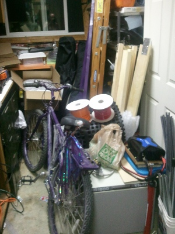
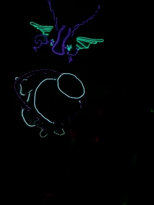

 

Among other things:

- My purple bike with purple wings.
- Stuff to build a shower enclosure and evaporation pool.
- Some "flying buttresses" (purple 2x4s) to provide some additional support for my popup camper
- A propane powered ice chest.
- 1200 watt inverter (which is way more than I need)
- A 10x10 foot shade (A [Quik Shade Summit 233](http://www.sportchalet.com/product/outdoor/camping/canopies+-+screen+houses/300807_3068359.do), which I hope survives)
- A bunch of freeze dried and "tasty bites" food
- two really cool [desert festivale shade cloths](http://www.shadeclothstore.com/products/burningmanshadecloth__aluminetshadecloth.html) that I hope will help keep the camper cooler
- A el-wire encrusted "dragon" hat.
- A Victorian cape and top hat outlined in "flickering" el-wire
- A "steam punk" pendant with purple el-wire to go with the cape
- A softly glowing (i.e. invisible in the picture) furry coat
- A few hundred feet of purple and orange el-wire \*
- 20 1/2" fiberglass rods \*
- 20 36" x 1/2" rebar poles with 1/2" conduit attachments for the fiberglass rods \*
- A bunch of tools, including a butane soldering iron \*

I'm almost ready. Which is good considering that I'm off to [Summer Meltdown](http://www.summermeltdown.com/ "Summer Meltdown") this weekend and driving down to Black Rock City next weekend. So not much more time. And yes: two weeks in the desert. The first helping get the emergency response system software running and improved.

\* And the project (described in an earlier post) is back on. I never liked the platform, but it finally hit me that I could put the fiberglass rods closer together  and use motion sensors pointing outward to detect when people are around. Right now I'm thinking two modes: a changing pattern mode when nobody is around and when someone is detected, light up the purple everywhere and the orange only where I detect someone moving. See if people create their own games using the thing. Or I could get fancier. At this point it is all going to be a "work in progress" as the rods aren't built, I don't have the sensors or the Arduino Mega I need for all those I/O pins (both are on the way).

I'm also still worried about the stability of the fiberglass rods in the wind. I'll need plenty of space around to keep them from hitting things should they oscillate wildly. Also, not sure how long it will take for them to dig themselves a nice big loose hole, even with the 36" rebar for stabilization.

I guess it is all a grand experiment.
