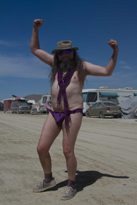

Well made it to Burning Man, built my art project, and made it back home.

When I first arrived, a week early so I could work on some [ESD](http://www.brcesd.org/) software, there was very little out at 8:15 and H where I camped. The following video was during a relatively mild wind storm. The camper, sun shade, and shower enclosure stood up well to the wind. The shower enclosure is laying down in the wind in this video, but the later addition of some tie downs fixed that.

\[wpvideo U49cbwOp\]

Here is the area around me after everyone else moved in. It also shows my art project when partially finished.

\[wpvideo U31VUlbM\]

And finally the art project completed.

\[wpvideo uMnYEMiL\]

As always, no real description of the experience is possible. But try [this](http://www.youtube.com/results?search_query=burning+man+2012&oq=burning+man+2012&gs_l=youtube.3..0l10.1394.4297.0.9702.16.16.0.0.0.0.92.1096.16.16.0...0.0...1ac.1.ox8kyg_GW-Y) and [this](http://www.flickr.com/search/?q=burning+man+2012&f=hp) to get some idea.

