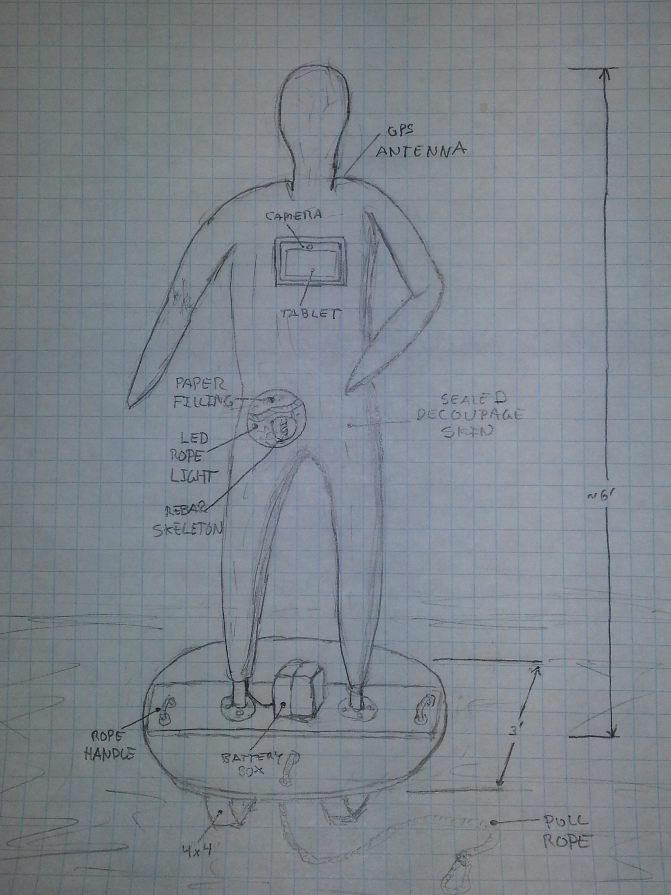
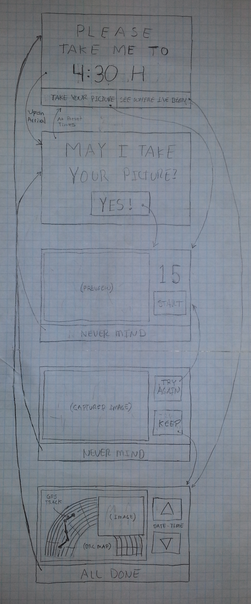
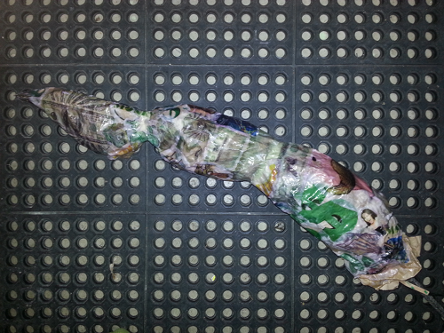

> Our enormously productive economy…demands that we make consumption our way of life, that we convert the buying and use of goods into rituals, that we seek our spiritual satisfaction, our ego satisfaction, in consumption…we need things consumed, burned up, replaced and discarded at an ever-accelerating rate.” – Victor LeBeau, Retail Analyst Post WW II

I was thinking about the [Burning Man 2013](http://www.burningman.com/art_of_burningman/bm13_theme.html) art theme, [Cargo Cult](http://en.wikipedia.org/wiki/Cargo_cult), when I came across the quote above. It seems particularly apropos for a number of reasons. Like [many](http://blog.burningman.com/2012/12/uncategorized/cargo-cult-is-a-daring-and-dangerous-theme-get-it-right/) [others](http://burnafterreadingmag.com/burning-man-2013-theme-cargo-cult-released-what-does-it-mean/), I find this year's theme very intriguing.

I was also reading [Kraken](http://en.wikipedia.org/wiki/Kraken_\(novel\)) by [China Miéville](http://en.wikipedia.org/wiki/China_Mi%C3%A9ville "China Miéville") at the time. One of the recurring themes in this book is the idea that beings assemble themselves from their environment powered by the beliefs, hopes, and fears of people across the years. People, by the way, who are not even aware of the existence of what they have created. I also recall a simular theme in [Neil Gaiman's](http://en.wikipedia.org/wiki/Neil_Gaiman) [Anansi Boys](http://en.wikipedia.org/wiki/Anansi_Boys) which I read years ago.

So, as is the nature of such things, these thoughts come together to inspire an art project for Burning Man 2013: a number of life sized humanoid statutes, each representing an iconic theme of modern culture (money, fashion, technology, religion, etc.), that will be dragged by random burners from location to location across Black Rock City for the duration of the event. I call them godlings.

The skin of each statue is a decoupage of images associated with the statue's theme. They are built around a rebar skeleton and stuffed with crumpled paper, making them sturdy but light weight. The statues are lighted from within, giving them a soft glow at night.

Each of these statues has embedded in it's chest an inexpensive tablet computer. The tablet will periodically display an BRC address and implore a passer-by to take them to that location. Occasionally multiple statues will be programmed to meet up at a common location (an unique experience for the people who drag them to there). Once "released" into the city, each godling will be on it's own... at the mercy of the burner community to get to where they want to go.

The tablet will also ask burners "may I take your picture?" and will record the time and (GPS) location of each snapshot. After the event these images along with the path taken by the statue through the city will be posted to a website.

So far, I've created a prototype arm, started welding a rebar skeleton (welding is new to me), and hacking on a tablet computer.

There is still a LOT I need to get done. For one thing, I need to figure out how long the battery will last. I may have to charge and swap out batteries every couple of days. I'll post updates here as I make progress.

I want to create as many of these statues as I can afford and time allows... let me know if your interested in helping out.
