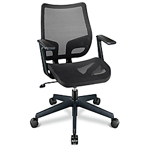

A requirement for a successful [Family Burn](http://eyeree.me/2013/11/18/family-burn/) will be to encourage my couch potatoish internet focused family (myself included) to actually interact with people. So, we are building the "Family Therapy" art car.

Starting with this (I can't believe I just bought this thing):

  

Remove those seat cushions and seat backs, then add something like this:

Along with four (one for each family member) of something like this:

Arranged something like this (click for a better look):

Finish it off with some carpet and wood paneling, and a bookshelf along the back. And some lights of course.

You know. Like a family therapist office, but backwards. The family is the therapist (like we have a clue). Get it?

We'll have pins and stickers for anyone who gets on our couch:

Anyway that is the idea. I'll post progress...
